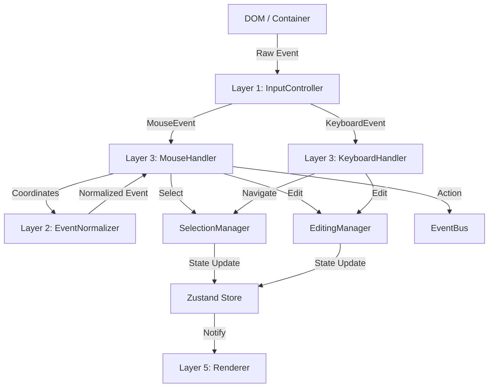

# Technical Deep Dive: Grid Interaction Subsystem

This document provides a comprehensive, code-level explanation of how every interaction is handled within the Grid project. It traces the execution flow from the raw browser event down to the state updates and rendering.

## Architecture Overview

The interaction system is layered. Raw events enter at the top and are progressively refined into semantic actions.



---

## Layer 0: The DOM Container

Regardless of whether you use `<canvas>` or `<div>`s (HTML/React), there is **always** a single root container element that receives focus.

-   **Canvas Mode**: The `<canvas>` element itself or a wrapper `<div>`.
-   **HTML/React Mode**: A wrapper `<div>` (`.ds-grid-html-container`).

This container **must** have `tabIndex="0"` to receive keyboard events.

---

## Layer 1: InputController (The Listener)

Located in: `src/core/engine/InputController.ts`

The `InputController` is the single point of entry. It does not contain logic; it simply binds standard DOM events to the engine's handlers.

```typescript
// InputController.ts
mount(element: HTMLElement) {
    // 1. Mouse Events
    element.addEventListener('mousedown', this.mouseHandler.handleMouseDown);
    element.addEventListener('mousemove', this.mouseHandler.handleMouseMove);
    element.addEventListener('mouseup', this.mouseHandler.handleMouseUp);
    element.addEventListener('wheel', this.handleWheel, { passive: false });

    // 2. Keyboard Events
    element.addEventListener('keydown', this.keyboardHandler.handleKeyDown);

    // 3. Global Clipboard (attached to document to catch Cmd+C even if focus is slightly off)
    document.addEventListener('copy', this.handleCopy);
}
```

**Why?** This decoupling means `MouseHandler` doesn't care about *where* the event came from, making it easier to test or swap implementations.

---

## Layer 2: EventNormalizer (The Translator)

Located in: `src/core/engine/EventNormalizer.ts`

This is the most critical component for the "Headless" architecture. It translates `x, y` pixel coordinates into `row, col` grid coordinates.

### The Normalization Process

When `MouseHandler` receives a `mousedown`, it immediately calls `normalizer.normalizeEvent(e)`.

```typescript
// EventNormalizer.ts
public normalizeEvent(event: GridInputEvent): NormalizedEvent | null {
    const { x, y } = event;
    
    // 1. Identify Region
    if (x < theme.rowHeaderWidth) return { target: 'row-header', ... };
    if (y < theme.headerHeight) return { target: 'header', ... };

    // 2. Translate to Grid Coordinates
    // Adjust for scroll offsets
    const gridX = x - theme.rowHeaderWidth + scrollLeft;
    const gridY = y - theme.headerHeight + scrollTop;

    // 3. Math: Pixels -> Index
    const rowIndex = Math.floor(gridY / theme.rowHeight);
    
    // 4. Column Search (Variable Widths)
    let colIndex = -1;
    let currentX = 0;
    for (let i = 0; i < visibleColumns.length; i++) {
        const col = visibleColumns[i];
        if (gridX >= currentX && gridX < currentX + col.width) {
            colIndex = i;
            break; // Found it!
        }
        currentX += col.width;
    }

    // 5. Hit Testing (Sub-cell interactions)
    // See Layer 4 for details
}
```

**Key Detail**: The Normalizer abstracts away the renderer. It doesn't care if a `<div>` exists at that position or if it's just pixels. It uses the **Grid Model** (row heights, col widths) as the source of truth.

---

## Layer 3: The Handlers (The Decision Makers)

Located in: `src/core/engine/MouseHandler.ts` and `KeyboardHandler.ts`.

These classes decide *what* the user intends to do.

### Scenario A: Selecting a Cell
**File**: `MouseHandler.ts`

```typescript
handleMouseDown = (e: MouseEvent) => {
    // 1. Normalize
    const event = this.engine.eventNormalizer.normalizeEvent(e);
    if (!event) return;

    // 2. Check specific targets
    if (event.target === 'cell') {
        const { col, row } = event;
        
        // 3. Handle Modifiers
        if (e.shiftKey) {
            // Range Select
            this.engine.selection.extendSelection(row, col);
        } else if (e.metaKey || e.ctrlKey) {
            // Multi Select (Add Range)
            this.engine.selection.addRange({ ... });
        } else {
            // Simple Select
            this.engine.selection.selectCell(row, col);
        }
        
        // 4. Start Drag State
        this.isDragging = true;
    }
}
```

### Scenario B: Dragging to Select
**File**: `MouseHandler.ts`

```typescript
handleMouseMove = (e: MouseEvent) => {
    if (!this.isDragging) return;

    // 1. Normalize again
    const event = this.engine.eventNormalizer.normalizeEvent(e);
    
    // 2. Update Selection Range
    // We don't start a NEW selection, we EXTEND the existing one
    if (event.target === 'cell') {
        this.engine.selection.extendSelection(event.row, event.col);
    }
}
```

### Scenario C: Double Click to Edit
**File**: `MouseHandler.ts`

```typescript
handleDoubleClick = (e: MouseEvent) => {
    // 1. Normalize
    const event = this.engine.eventNormalizer.normalizeEvent(e);
    
    // 2. Trigger Edit
    if (event.target === 'cell') {
        this.engine.editing.startEdit(event.row, event.col);
    }
}
```

---

## Layer 4: Hit Testing & Action Cells

This is where things get deep. How does the grid know you clicked the "Delete" trash icon *inside* a cell?

**Mechanism**: `onHitTest` Protocol.

1.  **Definition**: The Cell Type definition (e.g., `action/index.ts`) implements `onHitTest`.
2.  **Normalizer Integration**:

```typescript
// EventNormalizer.ts
private handleHitTest(...) {
    // 1. Get Cell Type Definition
    const definition = cellTypeRegistry.get(type);
    
    // 2. Ask Cell Type: "Did this (x,y) hit anything special?"
    if (definition.onHitTest) {
        return definition.onHitTest(context, x, y);
    }
}
```

3.  **Cell Implementation** (`action/index.ts`):

```typescript
// action/index.ts
onHitTest(context, x, y) {
    // 1. Calculate button positions
    // (Same math used in render function to ensure alignment)
    const startX = context.x + (width - totalWidth) / 2;
    
    // 2. Check bounds
    if (x >= btnX && x <= btnX + btnWidth) {
        return { action: 'delete-button', payload: ... };
    }
    return null;
}
```

4.  **Execution**:
    If `onHitTest` returns a result, `MouseHandler` sees `event.action` is present. instead of selecting the cell, it emits an event:
    `this.engine.eventBus.emit('cell:action', event.action);`

---

## Layer 5: State Managers (The Truth)

Located in: `src/core/engine/SelectionManager.ts`, `EditingManager.ts`.

These managers invoke Zustand state updates.

```typescript
// SelectionManager.ts
selectCell(row, col) {
    // 1. Validate
    if (outOfBounds) return;

    // 2. Update State (Immutable)
    this.deps.store.setState({
        selection: {
            primary: { row, col },
            ranges: [{ start: { row, col }, end: { row, col } }]
        }
    });
    
    // 3. Emit Change Event
    this.deps.eventBus.emit('selection:change', ...);
}
```

**Deep Dive: Why Managers?**
Separating logic from the `GridEngine` class prevents the Engine from becoming a "God Object". The Engine just holds instances of these managers.

---

## Layer 6: Renderers (The Visuals)

The state has changed. Now what?

### Canvas Renderer
1.  Subscribes to the main loop or events.
2.  On next frame (`requestAnimationFrame`):
    -   Reads `store.selection`.
    -   Draws a blue border around the cells specified in `selection.ranges`.
    -   **Action Cells**: Draws the icons at the exact same coordinates the `Normalizer` used for hit testing.

### HTML/React Renderer
1.  Subscribes to state changes (React does this via hooks/context).
2.  **Reconciliation**:
    -   `useGridSelection` hook updates.
    -   React re-renders the `SelectionOverlay` component.
    -   Divs move to the new `top/left` positions.
3.  **Clicking Elements**:
    -   In HTML mode, elements might have `data-action="delete"`.
    -   **EventNormalizer HTML Hook**:
        ```typescript
        // EventNormalizer.ts
        if (originalEvent.target instanceof HTMLElement) {
            const actionNode = originalEvent.target.closest('[data-action]');
            if (actionNode) {
                return { action: actionNode.dataset.action, ... };
            }
        }
        ```
    -   This allows DOM-based click handling to bypass the pixel math of `onHitTest` if desired, but the result (`cell:action` event) is the same.

---

## Summary: The "Life of a Click"

1.  **User** clicks pixel `(150, 200)`.
2.  **Browser** fires `mousedown` on `<div class="grid-container">`.
3.  **InputController** catches it, calls `mouseHandler.handleMouseDown(e)`.
4.  **MouseHandler** asks `EventNormalizer`: "What is at (150, 200)?"
5.  **EventNormalizer**:
    -   Subtracts headers.
    -   Calculates `Grid Y = 120`, `Grid X = 60`.
    -   Determines `Row 3`, `Column 2`.
    -   Checks `Column 2` type ("Action").
    -   Calls `ActionType.onHitTest`.
    -   Result: "Hit Delete Button".
6.  **MouseHandler** sees "Action Hit".
    -   Emits `cell:action` with payload "delete".
7.  **EventBus** broadcasts `cell:action`.
8.  **App Logic** (outside engine) listens to `cell:action`, sees "delete", and calls `engine.rows.deleteRow(3)`.
9.  **Rows Manager** updates data model.
10. **GridEngine** triggers render.
11. **Renderer** draws grid without Row 3.

